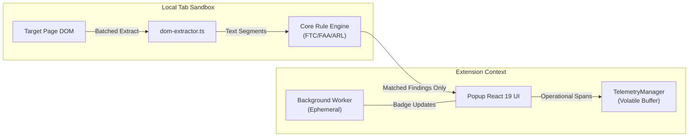

# Architecture & Invariants Specification: KnowThankYew Reality Engine

> Technical architecture, security boundaries, and portfolio alignment for `knowthankyew-extension`.

---

## 1. Executive Summary

`knowthankyew-extension` is the 11th repository of the [`knowthankyew`](https://github.com/knowthankyew) open-source portfolio. It serves as an in-browser "reality engine" that brings the statutory clause evaluation logic from `bill-of-rights-bot` and `lease-audit` directly into the user's browser toolbar under Manifest V3.

---

## 2. The 5 Architectural Pillars



### Pillar 1: Volatile Memory State & Local-Only Processing
The extension never writes document excerpts, page URLs, or audit traces to disk. Operational telemetry is configured as `memory_only`, and scan results are held in the popup and injected content-script contexts. The current implementation does not use `chrome.storage.local` as the telemetry or scan-result store, and it never uses `chrome.storage.sync`.

The `storage` permission is retained so the hard-burn routine can clear the extension's local storage namespace and so future local-only settings can be added without changing the privacy boundary. In the current release, `chrome.storage.local` is a cleanup target rather than the source of truth for runtime telemetry or findings.

### Pillar 2: Compile-Time Dead-Code Shims & CSP Boundaries
- **Manifest CSP:** `extension_pages` specifies `connect-src 'none'`, physically forbidding popup and background worker environments from initiating outbound network traffic.
- **Content Script Isolation & CSP Distinction:** Manifest V3's `connect-src 'none'` CSP strictly governs extension pages (popup, options page, service worker). Injected content scripts run in an isolated execution world inside the host page. Content script air-gapping is therefore enforced **by architectural design and compile-time dead-code exclusion** (confirmed via automated `dist/content/scanner.js` regex audits and Puppeteer zero-egress interception tests), rather than relying on extension page CSP.
- **OTLP Shims:** `vite.config.ts` ensures that unless an enterprise build explicitly injects `VITE_OTEL_EXPORTER_OTLP_ENDPOINT`, network telemetry exporter functions are excised at build time.
- **Local ML Air-Gap Boundary & Trust Delta:** Loopback communications (`http://127.0.0.1:8420`) are governed by compile-time flag `__LOCAL_ML_ENABLED__`. In standard production Chrome Web Store builds, the `air-gap-zero-egress` plugin physically strips all `fetch()` calls from `dist/`, ensuring that release builds maintain zero-egress compliance with CSP `connect-src 'none'`. Developer builds with Local Assist enabled are distributed via GitHub Releases backed by CycloneDX SBOM and SLSA Level 3 build provenance.

### Pillar 3: Strict Fail-Closed Allowlisting
All telemetry spans emit attributes validated against `SAFE_ALLOWLIST_KEYS` and `EXTENSION_ALLOWLIST_KEYS`. Arbitrary properties are silently stripped.

### Pillar 4: Zero Raw Text Egress & Least Privilege Injection
The content script executes all heuristic pattern matching locally in the tab. Only structured categorical findings (e.g. `ruleId: "AR-001"`, `severity: "CRITICAL"`) and sanitized text snippets are passed across browser boundaries. Permissions are strictly bound to `activeTab` + `scripting`, preventing passive background monitoring across tabs.

### Pillar 5: The Hard Burn
A single invocation of `hardBurnAllData()` drains the in-memory telemetry buffer, clears the extension's `chrome.storage.local` namespace, clears toolbar badge indicators, and broadcasts `KTY_HARD_BURN_DOM` to every open tab. Each injected content script that receives the message disconnects its `MutationObserver`, clears its cached scan result, resets extraction state, and removes extension-owned DOM attributes.

When Local ML assistance is active, `hardBurnAllData()` additionally issues a fire-and-forget `POST /burn` command to the loopback worker (`http://127.0.0.1:8420/burn`), instructing the external process to purge in-memory prompt contexts and KV caches without blocking the instant browser-side DOM and storage wipe.

Hard burn is best-effort rather than transactional: tabs may be closed, restricted, or lack an injected content script, and those failures do not prevent cleanup of the other tabs or the extension context that initiated the burn.

### Upstream Regulatory Pipeline & Declarative Policy Packs
Statutory rules are decoupled from TypeScript ASTs into declarative JSON policy packs (`src/core/policy-packs/us-federal.json` and `state-arl.json`).
- **Declarative Structure:** Each rule contains standard classifications, plain explanations, regex pattern strings verified against ReDoS via `safe-regex`, and regulatory tracking metadata (`apiKeywords`, `statuteCode`, `lastVerifiedDate`).
- **Federal Register Monitor:** A GitHub Action (`.github/workflows/legal-statute-monitor.yml`) calls `scripts/check-statutory-updates.mjs` against the public Federal Register API to detect published final rules and notices touching tracked citations (ROSCA, FTC Negative Option Rule, Click-to-Cancel, FAA Arbitration).
- **Human-in-the-Loop Draft PR Gate:** The workflow generates a GitHub **Draft Pull Request** with official Federal Register links and abstracts rather than autonomously mutating rules or synthesizing patches, eliminating AI hallucination risks in statutory enforcement.

### 2-Stage Legal Link Discovery Cascade
Finding governing consumer contracts on multi-sided platforms (e.g., DoorDash Consumer vs. Dasher vs. Merchant terms) utilizes a 2-stage cascade:
1. **Stage 1 (DOM Heuristics):** In-tab extractor scans `<a>` elements and well-known route maps locally in <2ms.
2. **Stage 2 (Local ML Reranker):** When multiple candidate agreements exist and Local ML Assist is active, candidate titles/URLs are dispatched to `POST /classify-links` on loopback. The model promotes the true consumer agreement to the primary position. If the local worker is offline, the engine falls back seamlessly to heuristic priority sorting.

### Runtime Activation and Dynamic Observation
The extension has no manifest-declared `content_scripts` entry. The popup injects `content/scanner.js` into the active tab only when the user invokes the extension. Once injected, the scanner performs an initial local scan and installs a debounced `MutationObserver` on that tab's document body to detect dynamically inserted terms, checkout modals, and asynchronous subscription clauses.

This means the runtime model is **user-initiated activation with post-activation observation**, not strictly click-to-scan. Automatic rescans are bounded by a 400 ms debounce, a 25-character extracted-text delta threshold, and a maximum of 15 scans per minute. The observer remains active until the content script receives `KTY_HARD_BURN_DOM`, the scanner is explicitly stopped, or the tab is destroyed.

### Runtime State and Cleanup Boundaries
- **Popup:** React state holds the currently displayed `PageScanResult` and UI state.
- **Content script:** Module-local state holds the latest scan result, extracted-text length, observer, and debounce timers.
- **Telemetry:** `TelemetryManager` holds allowlisted operational spans and audit events in memory only.
- **Chrome storage:** No current scan or telemetry write path uses `chrome.storage.local`; hard burn clears the namespace as a defensive cleanup operation.

Consequently, reopening the popup or navigating away can discard context-local state independently of the other extension contexts. Hard burn coordinates the known contexts but should not be described as a durable or atomic transaction.

---

## 3. Directory Structure

```
knowthankyew-extension/
├── .github/workflows/       # CI, Release, and Weekly Statutory Monitor workflows
├── manifest.json            # Manifest V3 configuration (activeTab, storage, scripting)
├── package.json             # React 19 + TypeScript + @knowthankyew/privacy-telemetry
├── vite.config.ts           # Multi-input bundling with compile-time air-gap shims
├── public/                  # Manifest and generated PNG icons (16, 48, 128)
├── scripts/                 # Asset generators & check-statutory-updates.mjs
├── src/
│   ├── background/          # Ephemeral MV3 service worker
│   ├── content/             # Isolated DOM extractor & 2-stage link discovery
│   ├── core/
│   │   ├── policy-packs/    # Declarative JSON statutory packs (us-federal, state-arl)
│   │   ├── rules/           # Typed statutory rule definitions
│   │   └── engine.ts        # Dynamic policy compiler & reality engine scanner
│   ├── ml/                  # Local ML loopback client (127.0.0.1:8420) & /burn contract
│   ├── telemetry/           # Privacy telemetry singleton & Hard Burn controller
│   └── popup/               # React 19 popup UI & PrivacyAuditModal
└── tests/                   # Vitest suite (policy packs, ML client, ReDoS, Chromium E2E)
```
