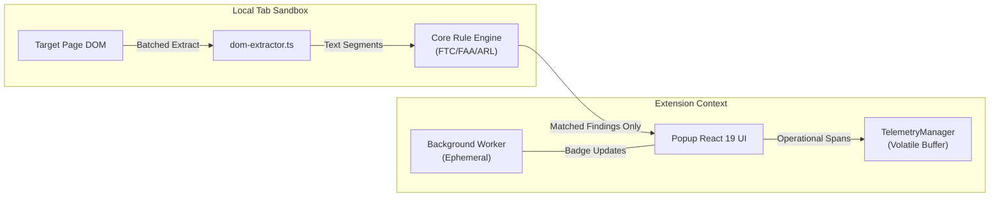

# Architecture & Invariants Specification: KnowThankYew Reality Engine

> Technical architecture, security boundaries, and portfolio alignment for `knowthankyew-extension`.

---

## 1. Executive Summary

`knowthankyew-extension` is the 11th repository of the [`knowthankyew`](https://github.com/knowthankyew) open-source portfolio. It serves as an in-browser "reality engine" that brings the statutory clause evaluation logic from `bill-of-rights-bot` and `lease-audit` directly into the user's browser toolbar under Manifest V3.

---

## 2. The 5 Architectural Pillars



### Pillar 1: Volatile Memory State & Local-Only Processing
The extension never writes document excerpts, page URLs, or audit traces to disk. Operational telemetry is configured as `memory_only`, and scan results are held in the popup and injected content-script contexts. The current implementation does not use `chrome.storage.local` as the telemetry or scan-result store, and it never uses `chrome.storage.sync`.

The `storage` permission is retained so the hard-burn routine can clear the extension's local storage namespace and so future local-only settings can be added without changing the privacy boundary. In the current release, `chrome.storage.local` is a cleanup target rather than the source of truth for runtime telemetry or findings.

### Pillar 2: Compile-Time Dead-Code Shims & CSP Boundaries
- **Manifest CSP:** `extension_pages` specifies `connect-src 'none'`, physically forbidding popup and background worker environments from initiating outbound network traffic.
- **Content Script Isolation:** Content scripts run in an isolated execution world without network calls (`fetch`, `XMLHttpRequest`, `WebSocket`). Invariant verified via Puppeteer negative-control tests (`tests/chromium-e2e.test.ts`) asserting 0 egress packets during execution.
- **OTLP Shims:** `vite.config.ts` ensures that unless an enterprise build explicitly injects `VITE_OTEL_EXPORTER_OTLP_ENDPOINT`, network telemetry exporter functions are excised at build time.

### Pillar 3: Strict Fail-Closed Allowlisting
All telemetry spans emit attributes validated against `SAFE_ALLOWLIST_KEYS` and `EXTENSION_ALLOWLIST_KEYS`. Arbitrary properties are silently stripped.

### Pillar 4: Zero Raw Text Egress & Least Privilege Injection
The content script executes all heuristic pattern matching locally in the tab. Only structured categorical findings (e.g. `ruleId: "AR-001"`, `severity: "CRITICAL"`) and sanitized text snippets are passed across browser boundaries. Permissions are strictly bound to `activeTab` + `scripting`, preventing passive background monitoring across tabs.

### Pillar 5: The Hard Burn
A single invocation of `hardBurnAllData()` drains the in-memory telemetry buffer, clears the extension's `chrome.storage.local` namespace, clears toolbar badge indicators, and broadcasts `KTY_HARD_BURN_DOM` to every open tab. Each injected content script that receives the message disconnects its `MutationObserver`, clears its cached scan result, resets extraction state, and removes extension-owned DOM attributes.

Hard burn is best-effort rather than transactional: tabs may be closed, restricted, or lack an injected content script, and those failures do not prevent cleanup of the other tabs or the extension context that initiated the burn. The popup, service worker, and content scripts are separate extension contexts, so their in-memory state is not one shared heap; the cross-tab message is the coordination mechanism for content-script teardown.

### Runtime Activation and Dynamic Observation
The extension has no manifest-declared `content_scripts` entry. The popup injects `content/scanner.js` into the active tab only when the user invokes the extension. Once injected, the scanner performs an initial local scan and installs a debounced `MutationObserver` on that tab's document body to detect dynamically inserted terms, checkout modals, and asynchronous subscription clauses.

This means the runtime model is **user-initiated activation with post-activation observation**, not strictly click-to-scan. Automatic rescans are bounded by a 400 ms debounce, a 25-character extracted-text delta threshold, and a maximum of 15 scans per minute. The observer remains active until the content script receives `KTY_HARD_BURN_DOM`, the scanner is explicitly stopped, or the tab is destroyed.

### Runtime State and Cleanup Boundaries
- **Popup:** React state holds the currently displayed `PageScanResult` and UI state.
- **Content script:** Module-local state holds the latest scan result, extracted-text length, observer, and debounce timers.
- **Telemetry:** `TelemetryManager` holds allowlisted operational spans and audit events in memory only.
- **Chrome storage:** No current scan or telemetry write path uses `chrome.storage.local`; hard burn clears the namespace as a defensive cleanup operation.

Consequently, reopening the popup or navigating away can discard context-local state independently of the other extension contexts. Hard burn coordinates the known contexts but should not be described as a durable or atomic transaction.

---

## 3. Directory Structure

```
knowthankyew-extension/
├── manifest.json            # Manifest V3 configuration (activeTab, storage, scripting)
├── package.json             # React 19 + TypeScript + @knowthankyew/privacy-telemetry
├── vite.config.ts           # Multi-input bundling for SW, Content Script, and Popup
├── public/                  # Manifest and generated PNG icons (16, 48, 128)
├── src/
│   ├── background/          # Ephemeral MV3 service worker
│   ├── content/             # Isolated DOM extractor & scanner
│   ├── core/                # Statutory rule definitions & evaluator
│   ├── telemetry/           # Privacy telemetry singleton & Hard Burn controller
│   └── popup/               # React 19 popup UI & PrivacyAuditModal
└── tests/                   # Vitest unit test suite (rules, engine, telemetry)
```
