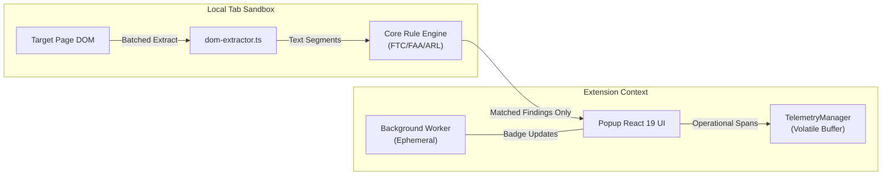

# Architecture & Invariants Specification: KnowThankYew Reality Engine

> Technical architecture, security boundaries, and portfolio alignment for `knowthankyew-extension`.

---

## 1. Executive Summary

`knowthankyew-extension` is the 11th repository of the [`knowthankyew`](https://github.com/knowthankyew) open-source portfolio. It serves as an in-browser "reality engine" that brings the statutory clause evaluation logic from `bill-of-rights-bot` and `lease-audit` directly into the user's browser toolbar under Manifest V3.

---

## 2. The 5 Architectural Pillars



### Pillar 1: Volatile Memory Buffer & Local-Only Storage
The extension never writes document excerpts, page URLs, or audit traces to disk. All metrics and volatile states use `chrome.storage.local` exclusively—`chrome.storage.sync` is strictly avoided to prevent any data from syncing to Google account servers.

### Pillar 2: Compile-Time Dead-Code Shims & CSP Boundaries
- **Manifest CSP:** `extension_pages` specifies `connect-src 'none'`, physically forbidding popup and background worker environments from initiating outbound network traffic.
- **Content Script Isolation:** Content scripts run in an isolated execution world without network calls (`fetch`, `XMLHttpRequest`, `WebSocket`). Invariant verified via Puppeteer negative-control tests (`tests/chromium-e2e.test.ts`) asserting 0 egress packets during execution.
- **OTLP Shims:** `vite.config.ts` ensures that unless an enterprise build explicitly injects `VITE_OTEL_EXPORTER_OTLP_ENDPOINT`, network telemetry exporter functions are excised at build time.

### Pillar 3: Strict Fail-Closed Allowlisting
All telemetry spans emit attributes validated against `SAFE_ALLOWLIST_KEYS` and `EXTENSION_ALLOWLIST_KEYS`. Arbitrary properties are silently stripped.

### Pillar 4: Zero Raw Text Egress & Least Privilege Injection
The content script executes all heuristic pattern matching locally in the tab. Only structured categorical findings (e.g. `ruleId: "AR-001"`, `severity: "CRITICAL"`) and sanitized text snippets are passed across browser boundaries. Permissions are strictly bound to `activeTab` + `scripting`, preventing passive background monitoring across tabs.

### Pillar 5: The Hard Burn
A single invocation of `hardBurnAllData()` flushes `chrome.storage.local`, drains the in-memory circular buffer, clears badge indicators, and leaves the extension in an amnesiac state.

---

## 3. Directory Structure

```
knowthankyew-extension/
├── manifest.json            # Manifest V3 configuration (activeTab, storage, scripting)
├── package.json             # React 19 + TypeScript + @knowthankyew/privacy-telemetry
├── vite.config.ts           # Multi-input bundling for SW, Content Script, and Popup
├── public/                  # Manifest and generated PNG icons (16, 48, 128)
├── src/
│   ├── background/          # Ephemeral MV3 service worker
│   ├── content/             # Isolated DOM extractor & scanner
│   ├── core/                # Statutory rule definitions & evaluator
│   ├── telemetry/           # Privacy telemetry singleton & Hard Burn controller
│   └── popup/               # React 19 popup UI & PrivacyAuditModal
└── tests/                   # Vitest unit test suite (rules, engine, telemetry)
```
