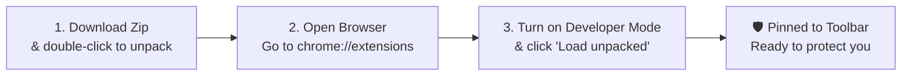

# How to Use KnowThankYew: The Plain-English User Guide

> **Welcome.** You don't need a computer science degree or a law degree to use this extension. This guide explains how to install it, what to expect on your screen, and how it protects you when buying things online.

---

## 1. What does this extension do?

Whenever you're on a website about to buy something or sign up for an account, companies bury dangerous clauses in tiny grey text. 

**KnowThankYew reads that fine print instantly and warns you:**
- **Red Alert 🚨**: Serious rights waivers (e.g. giving up your right to sue in court, or enrolling you in a surprise recurring subscription).
- **Amber Alert ⚠️**: Squeeze tactics (e.g. forced phone calls just to cancel a service, or vendor claiming they can change prices on you whenever they feel like it).
- **Clear Badge**: No predatory traps detected in the visible checkout text.

---

## 2. How to Install It (Takes 60 Seconds)

You do **not** need to install programming tools or open a black terminal window.



### 1. Download
Click this link to download the pre-packaged zip file directly:  
👉 **[Click Here to Download: knowthankyew-extension-v1.0.0.zip](https://github.com/knowthankyew/knowthankyew-extension/releases/download/v1.0.0/knowthankyew-extension-v1.0.0.zip)**  
*(Or view the [GitHub Releases page](https://github.com/knowthankyew/knowthankyew-extension/releases/latest)).*

Once downloaded to your `Downloads` folder, double-click it to unzip. You will see a folder containing the extension.

### 2. Open Your Browser Extensions Page
Open **Google Chrome**, **Brave**, or **Microsoft Edge**.  
In the top address bar where you type website URLs, type:
```text
chrome://extensions
```
and press **Enter**.

### 3. Turn on Developer Mode & Load
1. Look at the **top right corner** of the page. You will see a switch that says **Developer mode**. Click it so it turns **ON (blue)**.
2. In the **top left corner**, a button will appear that says **Load unpacked**. Click it.
3. In the file window that opens, select the folder you just unzipped in Step 1.
4. Click **Select** or **Open**.

### 4. Pin It to Your Toolbar
Look at the top right of your browser next to your address bar:
1. Click the **puzzle piece icon** (Extensions).
2. Find **KnowThankYew Reality Engine** in the list.
3. Click the little **Pin icon** next to it so the shield stays on your toolbar.

---

## 3. How to Use It in the Wild

You don't have to do anything special. Just browse the web normally.

### When You Visit a Checkout Page:
1. Look at the KnowThankYew shield icon in your toolbar.
2. If the website has hidden traps, a **number badge** will appear on the shield:
   - **Red badge with a number**: Critical traps found (like automatic recurring billing or mandatory arbitration).
   - **Amber badge with a number**: Warning traps found (like phone-only cancellation or unilateral term changes).
3. **Click the shield icon.**
   - A clean window drops down showing each clause in plain English.
   - It quotes the exact sentence the company hid in their terms.
   - It explains the exact legal statute protecting you (such as the federal **ROSCA** law that bans hidden recurring billing).

---

## 4. What is the Big Red "Burn Data" Button?

At the bottom of the extension popup, you will see a red button that says **"Burn Local Data"**.

### What happens when you click it:
- The extension immediately purges all in-memory buffers.
- It removes any temporary highlights or counters from the page.
- It resets its own memory to absolute zero.
- It locks the extension into complete amnesia until you restart your browser.

**Why does this matter?**  
Because other software retains your history or logs your activity to sell to advertisers. KnowThankYew gives you a physical self-destruct button for local application memory.

---

## 5. Frequently Asked Questions

#### Q: Do I have to create an account or give my email?
**No.** KnowThankYew has no user accounts, no login screens, and collects zero personal information.

#### Q: Can KnowThankYew see my credit card number or password?
**No.** KnowThankYew only reads public terms and disclaimer containers on the page. Furthermore, the extension contains a strict security rule that physically blocks it from connecting to the internet. Even if it tried, your browser's security engine would drop the connection.

#### Q: Does it cost money?
**No.** KnowThankYew is 100% free and open source under the MIT License. It was built as a public service for consumer sovereignty.

#### Q: Why isn't it in the official Chrome Web Store yet?
We are currently undergoing the official Google Store review process for our **v1.1.0 release**. Loading it unpacked via the 60-second steps above gives you the exact same protection right now without waiting for Google's review queue.

---

*Need help or found a new dark pattern in the wild? File an issue on our [public GitHub page](https://github.com/knowthankyew/knowthankyew-extension/issues).*
