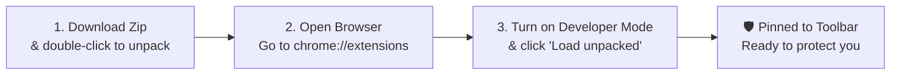

# How to Use KnowThankYew: The Plain-English User Guide

> **Welcome.** You don't need a computer science degree or a law degree to use this extension. This guide explains how to install it, what to expect on your screen, and how it protects you when buying things online.

---

## 1. What does this extension do?

Whenever you're on a website about to buy something or sign up for an account, companies bury dangerous clauses in tiny grey text. 

**KnowThankYew reads that fine print instantly and warns you:**
- **Red Alert 🚨**: Serious rights waivers (e.g. giving up your right to sue in court, or enrolling you in a surprise recurring subscription).
- **Amber Alert ⚠️**: Squeeze tactics (e.g. forced phone calls just to cancel a service, or vendor claiming they can change prices on you whenever they feel like it).
- **Clear Badge**: No predatory traps detected in the visible checkout text.

---

## 2. How to Install It (Takes 60 Seconds)

You do **not** need to install programming tools or open a black terminal window.



### 1. Download
Click this link to download the pre-packaged zip file directly:  
👉 **[Click Here to Download: knowthankyew-extension-v1.3.0.zip](https://github.com/knowthankyew/knowthankyew-extension/releases/download/v1.3.0/knowthankyew-extension-v1.3.0.zip)**  
*(Official Chrome Web Store v1.3.0 baseline release. Note: v1.4.0 is on hold pending resolution of 1.3 baseline issues).*

Once downloaded to your `Downloads` folder, double-click it to unzip. You will see a folder containing the extension.

### 2. Open Your Browser Extensions Page
Open **Google Chrome**, **Brave**, or **Microsoft Edge**.  
In the top address bar where you type website URLs, type:
```text
chrome://extensions
```
and press **Enter**.

### 3. Turn on Developer Mode & Load
1. Look at the **top right corner** of the page. You will see a switch that says **Developer mode**. Click it so it turns **ON (blue)**.
2. In the **top left corner**, a button will appear that says **Load unpacked**. Click it.
3. In the file window that opens, select the folder you just unzipped in Step 1.
4. Click **Select** or **Open**.

### 4. Pin It to Your Toolbar
Look at the top right of your browser next to your address bar:
1. Click the **puzzle piece icon** (Extensions).
2. Find **KnowThankYew Reality Engine** in the list.
3. Click the little **Pin icon** next to it so the shield stays on your toolbar.

---

## 3. How to Use It in the Wild

To protect your privacy, KnowThankYew **never watches your tabs in the background**. It runs only when you ask it to.

### When You Reach a Checkout or Signup Screen:
1. **Click the KnowThankYew shield icon** on your browser toolbar.
2. The extension instantly scans visible terms and fine print on the active tab without sending a single byte to the web.
3. If predatory terms are found:
   - **Red Alert 🚨**: Critical traps found (like automatic recurring billing or mandatory binding arbitration).
   - **Amber Alert ⚠️**: Squeeze tactics (like phone-only cancellation or post-trial conversion).
   - **Clear Badge**: No matching traps detected in visible text on that screen.
4. A clean window drops down showing each clause in plain English, quoting the buried sentence and explaining what statutory framework protects you (such as federal **ROSCA** or California ARL).
5. If the site dynamically modifies terms (like an expanding terms accordion), the on-page observer tracks dynamic changes while you interact with that checkout.

> *KnowThankYew is an educational and consumer transparency auditing tool. It is not legal advice.*

---

## 4. Total Amnesia: Burning Data & Reclaiming Memory
 
### A. Instant Tab Burn (From the Popup)
At the bottom of the extension popup, you will see a red button that says **"Hard Burn"**:
- Purges volatile memory buffers for that session.
- Dereferences DOM text and removes any temporary highlights or counters.
- Resets toolbar badge counters.
- Locks that tab into complete amnesia.

### B. Master Cross-Domain Burn (The Engine Dashboard)
Used the extension across dozens of websites and want to reclaim memory or purge all state across every domain at once?
1. Right-click the **KnowThankYew icon** on your browser toolbar $\rightarrow$ click **Options**.  
   *(Or click the **⚙️ Dashboard** button in the top right of the popup).*
2. A full-page **Engine Manager** tab will open up (styled like a VS Code extension manager).
3. Check your **Storage Meter** (bytes in use) and **Active Telemetry Buffers**.
4. Click the big red button: **"BURN ALL DATA ACROSS ALL DOMAINS"**.
5. It atomically clears local storage, drains in-memory buffers, and broadcasts a shutdown command to all open tabs across every domain to disconnect dynamic page observers and drop cached results.

**Why does this matter?**  
Because other software retains your history or logs your activity to sell to advertisers. KnowThankYew gives you absolute data sovereignty and a physical self-destruct button.

---

## 5. Frequently Asked Questions

#### Q: Do I have to create an account or give my email?
**No.** KnowThankYew has no user accounts, no login screens, and collects zero personal information.

#### Q: Can KnowThankYew see my credit card number or password?
**No.** KnowThankYew only reads public terms and disclaimer containers on the page. Furthermore, the extension contains a strict security rule that physically blocks it from connecting to the internet. Even if it tried, your browser's security engine would drop the connection.

#### Q: Does it cost money?
**No.** KnowThankYew is 100% free and open source under the MIT License. It was built as a public service for consumer sovereignty.

#### Q: Is it in the official Chrome Web Store?
**Yes!** You can install with one click directly from the **[Official Chrome Web Store Listing](https://chromewebstore.google.com/detail/knowthankyew-reality-engi/pbgjjgggmeecalifcgggiondfminilnl)**. If you prefer loading offline from source, follow the 60-second steps above.

---

*Need help or found a new dark pattern in the wild? File an issue on our [public GitHub page](https://github.com/knowthankyew/knowthankyew-extension/issues).*
